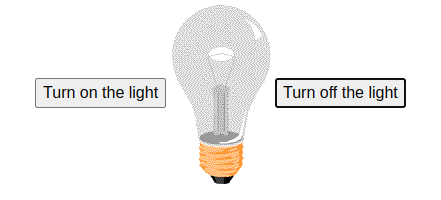
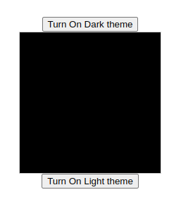
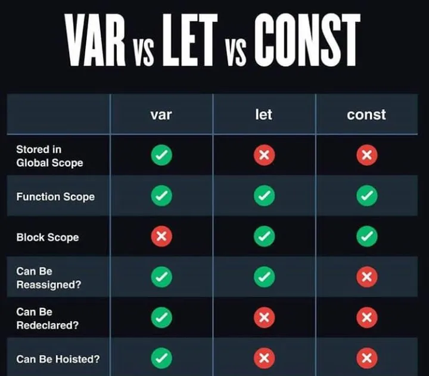
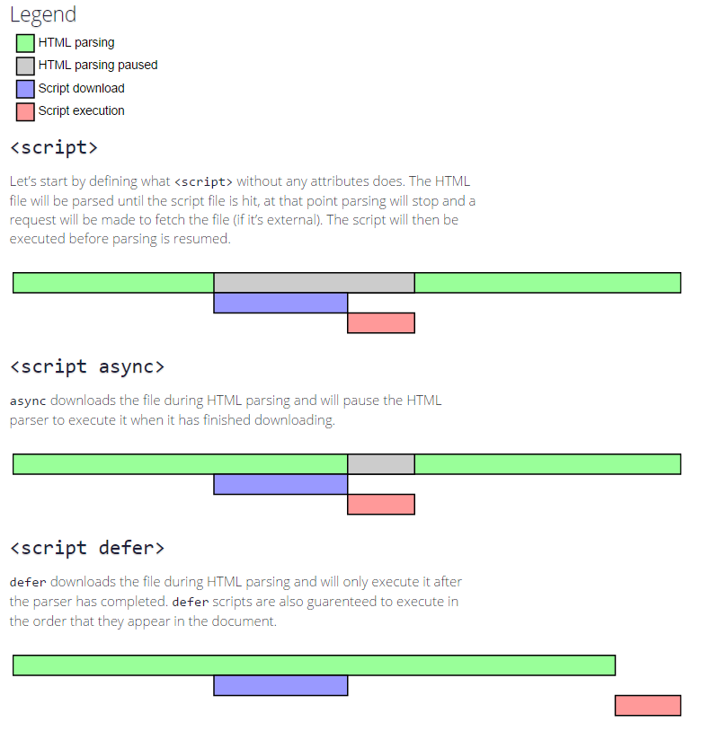

# Complete JavaScript Course

Welcome! 👋  
This repository contains a **complete JavaScript learning path**, structured week by week.  
It’s designed for **beginners, college students, and developers** who want to strengthen their JavaScript skills by learning fundamentals and building small projects along the way.  

---

## Table of Contents
- [Week 1: Introduction, Developer Tools, Basics](#week-1--introduction--basics)  
- [Week 2: Fundamentals & Interacting with Users](#week-2--fundamentals--interacting-with-users)  
- [Week 3: Arrays, Objects, JSON](#week-3--arrays-objects-json)  
- [Week 4: Functions, Generators, Events, Web Storage](#week-4--functions-generators-events-web-storage)  
- [Week 5: DOM, Dates, Built-in Methods, jQuery Basics](#week-5--dom-dates-built-in-methods-jquery-basics)  
- [Week 6: ES6 Features & OOP](#week-6--es6-features--oop)   

---

## Weekly Plan

### Week 1 – Introduction & Basics
**Day 1**
- What is JavaScript  
- Environment Setup  
- Developer Tools (Console, Network, Elements, etc.)  
- Writing the First JS Program  
- Internal / External / Inline Scripts  
- `onload` event usage  
- Comments

___

#### Introduction to JavaScript  
- JavaScript is the world's most popular high-level programming language.  
- It is an interpreted, dynamically-typed language.  
- Easy to learn, it’s a cross-platform, object-oriented scripting language used to make webpages interactive (e.g., having complex animations, clickable buttons, popup menus, etc.). It is primarily a client-side language.  
- There are also more advanced server-side versions of JavaScript such as Node.  
- It was invented by Brendan Eich in 1995 in 10 days.  
- ECMAScript is the official name of the JavaScript Language.  
- Latest version is ECMAScript 2018.  
- JavaScript is one of the 3 languages all web developers must learn:  
  1. **HTML** → to define the content of web pages.  
  2. **CSS** → to specify the layout of web pages.  
  3. **JavaScript** → to program the behavior of web pages.  

#### Environment Setup  
 - We have many tools like VS Code, Atom, Notepad++, Notepad etc., for developing JavaScript based applications using the features like automated suggestions, auto closing tags, function references etc.,
  1. **VS Code**  
  2. **Sublime Text**  
  3. **Komodo Edit**  
  4. **Atom**  
  5. **Brackets**  
  6. **Notepad++**

#### Developer Tools
- Browser has many options to debug the JavaScript applications using developer tools like
  1. **Elements** → to find HTML elements.  
  2. **Console** → to debug JavaScript console outputs.  
  3. **Sources** → to check what are the files involved in the application.
  4. **Network** → to check network calls, website loading time etc..
  5. **Performance** → to analyze the application overall performance.
  6. **Memory** → to check how much data is consuming by browser.
  7. **Application** → to store temporary and permanent data and many options like styles filtering, color picker etc.

#### Console
- Console used to debug JavaScript programs line by line
- It has many different types such as warn, error, log etc.,

#### View Source
- We can see the source code of the application using this feature. Press CTRL+U to see the source code or right click on browser and
click on view page source.

#### First JavaScript Program
- JavaScript can be written in 3 different ways: 
  1. Inline Scripting  
  2. Internal Scripting  
  3. External Scripting  
- Let’s write a simple JavaScript inline scripting program to display Hello World! in webpage.
- Let’s write light on/off functionality using JavaScript Program.



#### Internal Scripts
- If we write JavaScript in a html file with script tag, then we will call it
as internal scripting.
- It usually looks like this <script>....JavaScript code...</script>
- Let’s write a JavaScript Program Internal Scripting for dark theme and light theme functionality.



#### External Scripts
- If we write JavaScript in a separate file with extension .js, then we will call it as **external scripting**.
- Example: Let’s assume the JavaScript file name is index.js
```js
// JavaScript code
alert("Hello World!");
```
- If we include third-party scripts like **jQuery, React, Bootstrap** (via CDN links), which are faster to load, then it is called **third-party scripting**.
- jQuery, React, Bootstrap, Vue, Angular etc., are the frameworks built using JavaScript.
- TypeScript is the sibling to JavaScript which can’t be executed directly in the browser unless it converts into plain JavaScript, also called as vanilla JavaScript.
- Browser supports only HTML,CSS and JAVASCRIPT.

#### JavaScript Comments
- Comments are always helpful when we see our code later point of time. It is best practice to use comments at necessary places in JavaScript Programs. Writing more comments are bad practice.
- JavaScript has two types of comments:
    - 1.Single Line comments using doubt slashes
    - Example:
      ```
      // your comment
      ```
    - 2.Mult-line comments using slash star.
    - Example:
      ```
      /* comment
         one more comment
      */
      ```

#### Variables
JavaScript has 4 different types of variables.
  1. **Global Variables**
  2. **`var`**
  3. **`let`**
  4. **`const`**
- Global variables can override the browsers variables, so it’s not recommended way for creating variables.
- var is also global variable as well as local variable inside a function.
- let and const are having block scope, which means they can’t be accessed outside the block. For private data, we will use let and const keywords.
- Const cannot be reassigned, it can be modified for reference data types.


### Practiced Code
👉 [Day 1 – Full Implementation](week-1/day-1/index.html) 

--- 

**Day 2**
- Async and Defer
- Primitive vs Reference data types    
- Operators (arithmetic, assignment, comparison, logical)  
- How JS executes programs  
- Global object  
___

#### Async and Defer


#### Data Types in JavaScript
- Data Types are nothing but the kind of data we want to use, such as strings, numbers, objects, arrays, etc.
- JavaScript is **loosely typed** and **dynamically typed**, meaning we can assign any data type to variables and change them at runtime.
- JavaScript has **2 types of data types**:
  1. **Primitive Data Types**
  2. **Reference (Non-Primitive) Data Types**

#### 1. Primitive Data Types
There are **7 primitive data types** in JavaScript:

1. `string`  
2. `number`  
3. `bigint`  
4. `boolean`  
5. `undefined`  
6. `symbol`  
7. `null`  

- Primitive values are **immutable**, which means we can **reassign** values but not **mutate**.

**Example:**
```js
let name = "Venkatesh";
name.toUpperCase(); // We won’t get the desired output as it won’t mutate.
name=name.toUpperCase(); // It will give desired output as we are reassigning new value.
```

#### 1. String  

- A **string** is a sequence of characters used to represent text.  
- Strings can be created in two ways:  
  1. **String literal**  `"text"`  
  2. **String object**   `new String("text")`  
- Note: `new String()` creates an **object**, not a primitive. Wrapper objects are available for all primitives except `null` and `undefined`.  

**Example:**  
```js
let username = "Venkatesh";                // String literal (primitive)
let usernameObj = new String("Venkatesh"); // String object (reference type)
```

#### 2. Number  

- A **number** in JavaScript represents both integers and floating-point values.  
- JavaScript uses **64-bit floating point format** (so all ints, floats, and doubles are treated as `Number`).  
- You can create numbers either as a **primitive** or as a **`Number` object**.  

**Example:**  
```js
let slides = 5;                // Primitive number
let slidesObj = new Number(5); // Number object (rarely used)
let slidesFn = Number(5);      // Converts to primitive number
```

#### 3. BigInt  

- **BigInt** is used to represent whole numbers larger than 2^53 - 1 (the max safe integer in JavaScript).  
- It’s created by appending n at the end of an integer.

**Example:**  
```js
console.log(Number.MAX_SAFE_INTEGER); // 9007199254740991
let big = 9007199254740995n;
console.log(typeof big); // "bigint"
```

#### 4. Boolean

- A boolean can only have two values: true or false.
- Use primitive booleans instead of new Boolean() unless you explicitly need an object.

**Example**
```js
let isRunning = true;                // Primitive boolean
let isRecording = new Boolean(true); // Boolean object (not recommended)
console.log(typeof isRunning);       // "boolean"
console.log(typeof isRecording);     // "object"
```

#### 5. Symbol
- A Symbol creates a unique and immutable value.
- Even if two symbols have the same description, they are always different.
- Symbols are often used as object property keys.

**Example**
```js
let sym1 = Symbol("name");
let sym2 = Symbol("name");
console.log(sym1 === sym2); // false, always unique
```

#### 6. Undefined

- A variable that is declared but not assigned a value automatically gets undefined.
- It means "value not assigned".

**Example**
```js
let user;
console.log(user); // undefined
```

#### 7. Null
- Null represents the intentional absence of any value.
- Interestingly, typeof null returns "object" (a long-standing JavaScript bug).

**Example**
```js
let user = null;
console.log(user);             // null
console.log(typeof user);      // "object"
```

#### Reference (Non-Primitive) Data Types  

- Reference data types don’t store the actual value directly.  
- Instead, they **store a reference (memory address)** pointing to the location where the value is kept.  
- So, when we assign or copy a reference type, we are copying the **memory address**, not the actual value.  
- The main reference types in JavaScript are:  
1. `Array`  
2. `Function`  
3. `Object`  

**Example (Reference type):**  

| Variable | Address | Value (Object in memory) |
|----------|---------|--------------------------|
| user     | 2000    | `{ year: 2021 }`         |
| customer | 2000    | `{ year: 2021 }`         |

- Here, both `user` and `customer` **refer to the same object in memory (address 2000)**.  
- Changing one will also affect the other.  

```js
let user = { year: 2021 };
let customer = user;
customer.year = 2022;
console.log(user.year); // 2022 → because both point to the same memory reference
```

#### 1. Array

- An **Array** stores multiple values in a single variable.
- Arrays are **reference types** → assigning them to another variable will point to the same memory location, not create a new copy.

**Example** 

```js
let names = ["Vivek", "Venkatesh"];
let users = names;  
console.log(users);           // ["Vivek", "Venkatesh"]
console.log(users === names); // true (both point to the same reference)
```

#### 2. Function

- A **Function** performs a set of statements and can return a value.
- In JavaScript, functions are objects, which means they can also hold properties.

**Example** 

```js
function getUser() {
  return "Venkatesh";
}

// Adding property because functions are objects
getUser.username = "Koneti";  
console.log(getUser.username); // "Koneti"
console.log(getUser());        // "Venkatesh"
```

#### 3. Object

- An **Object** stores data in key-value pairs.
- Like arrays and functions, objects are reference types.
- When you copy an object, you copy its reference, not the actual data.

**Example** 

```js
let user = { name: "Venkatesh" };
let admin = user;  
admin.role = "Admin";

console.log(user);  // { name: "Venkatesh", role: "Admin" }
console.log(admin); // { name: "Venkatesh", role: "Admin" }
console.log(user === admin); // true (both share the same reference)
```

#### Operators in JavaScript
JavaScript provides different types of operators to perform operations on values and variables.

**Arithmetic Operators:**&nbsp;Arithmetic operators perform arithmetic on numbers (literals or variables).
- `+` → Addition (`5 + 3 = 8`)
- `-` → Subtraction (`5 - 3 = 2`)
- `*` → Multiplication (`5 * 3 = 15`)
- `/` → Division (`6 / 2 = 3`)
- `%` → Modulus (remainder) (`7 % 3 = 1`)
- `**` → Exponentiation (`2 ** 3 = 8`)
- `++` → Increment (`let a = 5; a++ → 6`)
- `--` → Decrement (`let b = 5; b-- → 4`)

**Assignment Operators:**&nbsp;Assignment operators assign values to JavaScript variables.
- `=` → Assign (`x = 10`)
- `+=` → Add and assign (`x += 5 → x = x + 5`)
- `-=` → Subtract and assign (`x -= 3 → x = x - 3`)
- `*=` → Multiply and assign (`x *= 2 → x = x * 2`)
- `/=` → Divide and assign (`x /= 4 → x = x / 4`)
- `%=` → Modulus and assign (`x %= 2 → x = x % 2`)

**Comparison Operators:**&nbsp;Comparison operators are used to test values and return `true` or `false`.
- `==` → Equal to (checks value only) (`5 == "5" → true`)
- `===` → Strict equal (checks value + type) (`5 === "5" → false`)
- `!=` → Not equal (`5 != 3 → true`)
- `!==` → Strict not equal (`5 !== "5" → true`)
- `>` → Greater than (`7 > 5 → true`)
- `<` → Less than (`7 < 5 → false`)
- `>=` → Greater than or equal (`7 >= 7 → true`)
- `<=` → Less than or equal (`5 <= 5 → true`)

**Logical Operators:**&nbsp;Logical operators are used to combine conditions

- `&&` → Logical AND (`true && false → false`)
- `||` → Logical OR (`true || false → true`)
- `!` → Logical NOT (`!true → false`)

#### How JavaScript Executes Programs

JavaScript is **single-threaded** and uses a **JavaScript Engine** (like V8 in Chrome). The execution process happens in steps:

**1. Compilation (Creation) Phase**
- Memory is allocated for variables and functions.
- Variables are initialized with `undefined`.
- Functions are stored entirely in memory.
- A **Global Execution Context (GEC)** is created.

**2. Execution Phase**
- Code is executed line by line.
- Variables get their actual values.
- Functions are invoked, creating **Function Execution Contexts** that are placed in the **Call Stack**.

**3. Call Stack**
- JavaScript uses a **stack structure** to manage function calls.
- The last function pushed is executed first (**LIFO → Last In, First Out**).

**4. Event Loop + Callback Queue (for async tasks)**
- Long tasks (`setTimeout`, `fetch`, `promises`) are handled by Web APIs.
- Once complete, callbacks are placed in the **Callback Queue**.
- The **Event Loop** moves them into the Call Stack when it’s empty.
- This makes JavaScript **non-blocking** even though it is single-threaded.

---

#### Global Object in JavaScript

The **global object** is the top-level object in JavaScript.  
It provides built-in functions and properties that can be accessed anywhere in the program.

**Global Object in Different Environments**
- **Browser** → `window`
- **Node.js** → `global`
- **Modern JS (Universal)** → `globalThis` (works in both)

**Examples**
```js
console.log(this);        // window (in browsers, in non-strict mode)
console.log(globalThis);  // works everywhere

// Global functions
console.log(isNaN("abc"));   // true
console.log(parseInt("42")); // 42

// Global variables attached to window
var x = 10;
console.log(window.x); // 10 (in browsers)

// But let/const are NOT added to the global object
let y = 20;
console.log(window.y); // undefined
```

### Week 2 – Fundamentals & Interacting With Users
**Day 3**
- Conditional statements (if, ternary, switch)  
- Loops (for, while, do-while, nested)  
- Break and continue  
- Small exercises  

**Day 4**
- Prompt, Alert, Confirm  
- Timers (`setTimeout`, `setInterval`, `clearInterval`)  
- Browser objects: Navigator, Location, History  

---

### Week 3 – Arrays, Objects, JSON
**Day 5**
- Arrays, multidimensional arrays  
- Array properties & methods  
- Array destructuring & spread  
- Searching methods (`find`, `findIndex`, `includes`)  
- Loops with arrays  
- 📝 Mini project: Todo App using arrays  

**Day 6**
- Objects (access, update)  
- Object destructuring & spread  
- Object methods & loops  
- JSON: stringify and parse  

---

### Week 4 – Functions, Generators, Events, Web Storage
**Day 7**
- Functions: normal, arrow, anonymous, self-invoking  
- Nested functions & closures  
- Arguments & default values  
- Callbacks, Promises, async/await  

**Day 8**
- Generators  
- Event handling (`onclick`, `onload`, `onchange`, mouse events)  
- Form validation  
- Drag & Drop  
- Web storage: LocalStorage, SessionStorage, Cookies  
- Debugging basics (breakpoints, page load network)  

---

### Week 5 – DOM, Dates, Built-in Methods, jQuery Basics
**Day 9**
- DOM introduction  
- Selecting elements, dynamic content  
- Styling, add/remove classes, create elements, attributes  

**Day 10**
- Date object (countdowns, timers)  
- String methods  
- Math object  
- Error handling (`try/catch/throw`)  
- jQuery basics (selectors, animations)  
- AJAX with jQuery  

---

### Week 6 – ES6 Features & OOP
**Day 11**
- ES6 features: `for...of`, new Math/Number methods  
- Global methods  
- Modules  
- Regular expressions  
- `Object.values`, `Object.keys`, `Object.entries`  
- String padding, exponentiation, `includes`  

**Day 12**
- OOP in JavaScript  
- Classes & objects  
- Encapsulation, abstraction, inheritance, polymorphism  
- OOP with functions  
- 📝 Mini project: User Management App using OOP  

---

## Goals of this Course
- Build solid JS fundamentals  
- Learn ES6+ features  
- Practice OOP in JS  
- Work on small projects & exercises  

---

## Note
This repo is a **learning resource**. You can follow week by week or jump into the topics you need.  

## 🤝 Contribution Guidelines  
Want to improve this repo? Feel free to fork, raise issues, or submit PRs.  

## ⭐ Support  
Give a ⭐️ if this project helped you and try to contribute and share with your developers.

## Let's Connect
[LinkedIn](https://www.linkedin.com/in/venkatesh-koneti)